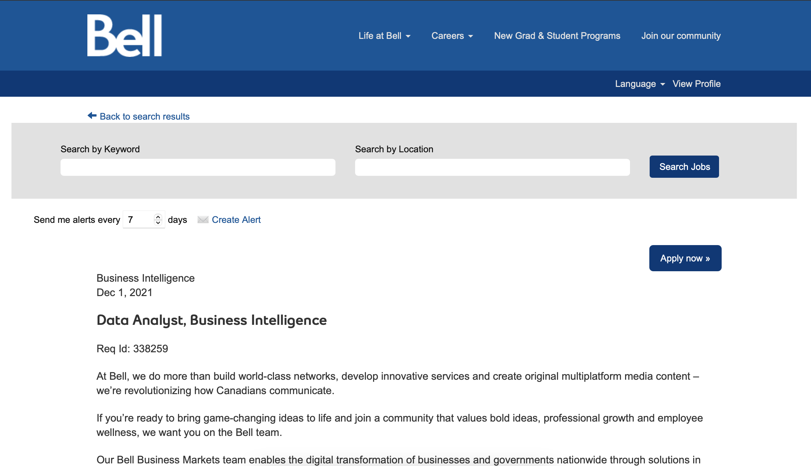
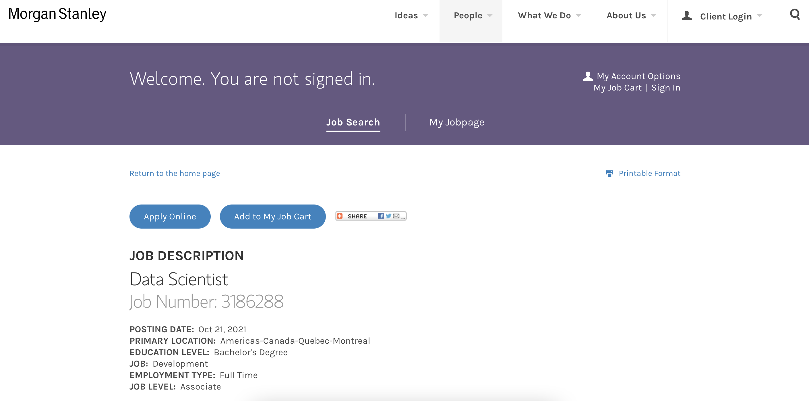
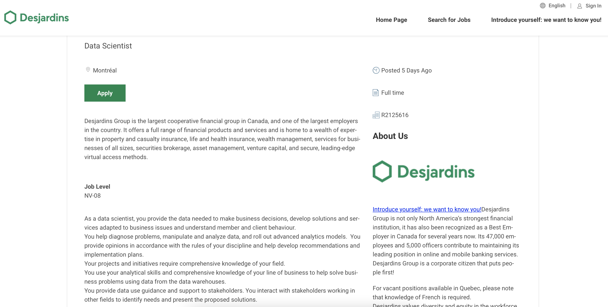

# Task 1: Data Science Careers

1. Bell - Data Analyst, Business Intelligence
	- https://jobs.bce.ca/bell/job/Montreal-Data-Analyst%2C-Business-Intelligence-QC/808841800/

2. Morgan Stanley - Data Scientist
	- https://ms.taleo.net/careersection/2/jobdetail.ftl?job=3186288&lang=en

3. Desjardins  - Data Scientist
	- https://desjardins.wd10.myworkdayjobs.com/en-US/Desjardins/job/Montral/Scientifique-de-donnes_R2125616-1

The question of why I selected this tree oportunities is susprinsigy not that complicated. When looking for a Data Science job the first thing that I think is what company would have cool data thats need to be analyze. Beacouser of this all Bell, Morgan and Dejardins, I think would have an interesting Data that could interest any Data Analysit. On the othetr hand this are also well known companies that could help boast my carrear into the future. And last they are in Canada so application and life after university would be easier to set up, that if had to move to another new country.

# Task 2: Highs and Lows

In general it was a great course. One think that I would chnage, that I belive is posible to chnage would be to add a weekly every week a HW is due a Tutorial. This would cover some of the most tech aspects of the HW, like the tutorial we had in Unitesting. This would help the moments of having no clue what you are doing, and just going into the web to know where to start
